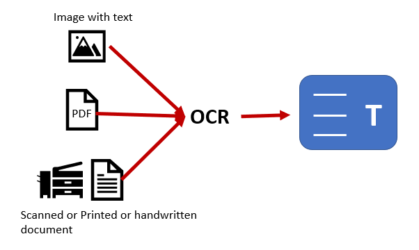
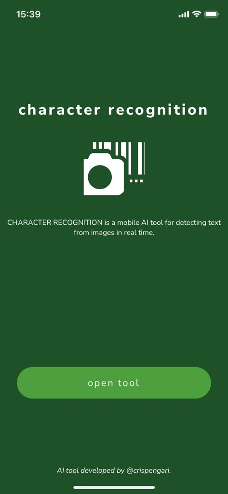
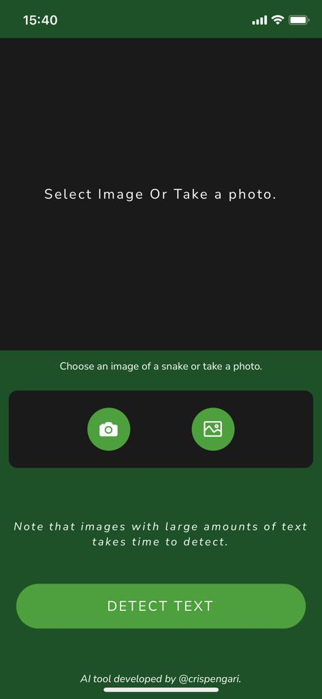
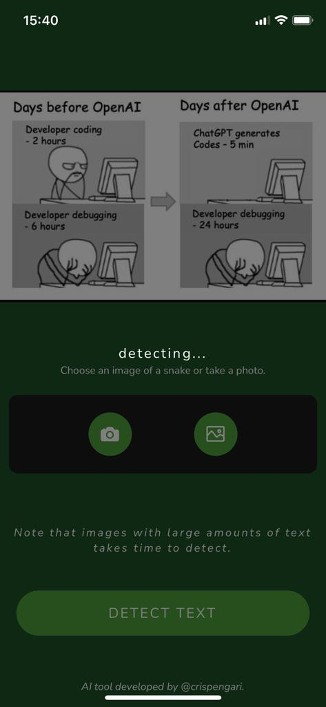

### CR

Character Recognition **(CR)**.

<p align="center">

<p>

📸📷 Character Recognition (CR) is an AI tool for performing optic character recognition task. Given an image from a camera or an imported image the application must be able to recognize the text that are in the image in real time.

<p align="center">

<p>

### API

CR api is a simple rest api that is served at `http://localhost:3001` and is able to detect text data from an image.

### Mobile

This is a mobile application that is consuming a rest api. The users are able to use this app to detect text from images that are in their gallery as well as images from their cameras.

<p align="center">




<p>

### API response

If a proper `POST` request is sent to the server at `http://127.0.0.1:3001/api/v1/recognize` we will be able to get all the text that were going to appear on the image.

### cURL request

If a `cURL` request is send to the server at localhost which looks as follows:

```shell
curl -X POST -F image=@text.png http://127.0.0.1:3001/api/v1/recognize
```

The server will respond with the `API` response which looks as follows:

```json
{
  "results": [
    "You might like",
    "See more",
    "nanou",
    "@NanouuSymeon",
    "2d",
    "Which Programming Language is good for",
    "beginners?",
    "874",
    "2",
    "161",
    "1,395"
  ],
  "success": true
}
```

> Note that the text that are detected on the images are listed as `results`.

### Server

The server is actually slow in making these detections because it is running on a `CPU`.

### Why CR?

Character recognition was developed because I realized that most of the time when I buy airtime they give me a slip which contains the recharge `PIN` which is very long to type. Using this `tool` users can just take a picture of the `PIN` number and then `CR` recognize all the numbers for you accurately and all you need to do is `copy` and paste.

### License

In this simple tool i'm using `MIT` license which read as follows:

```shell
MIT License

Copyright (c) 2022 crispengari

Permission is hereby granted, free of charge, to any person obtaining a copy
of this software and associated documentation files (the "Software"), to deal
in the Software without restriction, including without limitation the rights
to use, copy, modify, merge, publish, distribute, sublicense, and/or sell
copies of the Software, and to permit persons to whom the Software is
furnished to do so, subject to the following conditions:

The above copyright notice and this permission notice shall be included in all
copies or substantial portions of the Software.

THE SOFTWARE IS PROVIDED "AS IS", WITHOUT WARRANTY OF ANY KIND, EXPRESS OR
IMPLIED, INCLUDING BUT NOT LIMITED TO THE WARRANTIES OF MERCHANTABILITY,
FITNESS FOR A PARTICULAR PURPOSE AND NONINFRINGEMENT. IN NO EVENT SHALL THE
AUTHORS OR COPYRIGHT HOLDERS BE LIABLE FOR ANY CLAIM, DAMAGES OR OTHER
LIABILITY, WHETHER IN AN ACTION OF CONTRACT, TORT OR OTHERWISE, ARISING FROM,
OUT OF OR IN CONNECTION WITH THE SOFTWARE OR THE USE OR OTHER DEALINGS IN THE
SOFTWARE.

```
